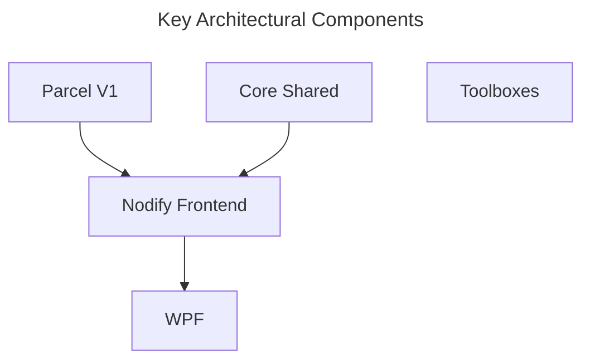

# Parcel

Last Update: 2024-06-09  
Versioning: Not-available.

Visual programming for data pipeline automation on local PC. Excel+.

This is a conceptual and functional demonstration of node-only Windows-only implementation for Parcel. It would suffice for the purpose of testing libraries and show casing the core software aspects of Parcel workflows. To keep things lean, we will NOT implement any additional frameworks/components on this, including dashboard capabilities - which was available in the original prototype.

For a demonstration of dashboard capabilities from an earlier iteration, see https://github.com/Charles-Zhang-Parcel/Parcel_V1_Prototype

## Versions

|Version|Parcel Original Prototype|PV1|PV1 Neo|
|-|-|-|-|
|Description|Original concept,  including dashboard component,  based on ASP.Net Core (hybrid mode).|Cleaned up version of original concept,  migrated to .Net 8.|Latest attempt to make it POS compliance, Official Windows frontend.|
|Status|Archive Only|Maintenance Only|Active Use|
|Feature Set|Demo Only|Demo Only|Partially POS Compliant; Full PSL|
|Dashboard Feature|Native|N/A|N/A|
|Link|[Link](https://github.com/Charles-Zhang-Parcel/Parcel_V1_Prototype)|[Link](https://github.com/Charles-Zhang-Parcel/Parcel_V1)|[Link](https://github.com/Charles-Zhang-Parcel/PV1_Neo)|

## Setup

All key components are implemented inside `Parcel.Shared` assembly, the front end is implemented in `Parcel.FrontEnd.NodifyWPF`, and all functional components are implemented in various **Toolboxes**.

1. Simply open `.sln` solution
2. Run `Parcel.FrontEnd.NodifyWPF` project

### To Add New Functionalities

Either inherit a class, or use shortcut methods. In the future, if we shall implement a way to load from assemblies automatically, it would make things way easier and allow interpolation from Parcel NExT.

## Management

No ADO management item has been created for this project yet.