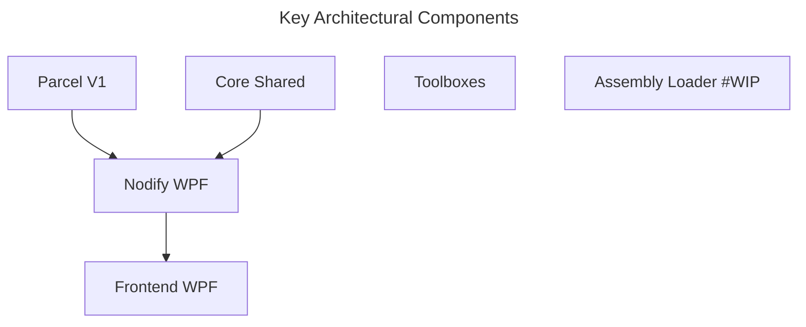

# Parcel

Visual programming for data pipeline automation on local PC. Excel+.

This is a node-only Windows-only implementation for Parcel conceptual and functional demonstrations. It would suffice for the purpose of testing libraries and show casing the core software aspects of Parcel workflows. To keep things lean, we will NOT implement any additional frameworks/components on this including dashboard capabilities.

For a demonstration of dashboard capabilities from an earlier iteration, see https://github.com/Charles-Zhang-Parcel/Parcel_V1_Prototype

## Setup

All key components are implemented inside `Parcel.Shared` assembly, the front end is implemented in `Parcel.FrontEnd.NodifyWPF`, and all functional components are implemented in various **Toolboxes**.

1. Simply open `.sln` solution
2. Run `Parcel.FrontEnd.NodifyWPF` project

### To Add New Functionalities

Either inherit a class, or use shortcut methods. In the future, if we shall implement a way to load from assemblies automatically, it would make things way easier and allow interoperation from Parcel NExT.

## Management

The corresponding ADO Epic for this is: https://dev.azure.com/ParcelEngine/Parcel/_workitems/edit/347
This particular project is outside of scope for Parcel NExT but is otherwise very relevant for library prototyping and client demonstration purposes.

For proper utilization of this project as a framework, one must follow guidelines as to integration with Parcel NExT (except for one-shot purposes).

### TODO

Pending migrating below tasks to ADO:

- [ ] (Maintenance) Upgrade framework to latest .Net 8
- [ ] (Maintenance) Implement custom binary serializer due to deprecation of .Net 6 BinaryFormatter
- [ ] (Tooling) Implement a simple "loader" utility that allows consumption of raw C# libraries from the Parcel NExT side for a smoother development process
